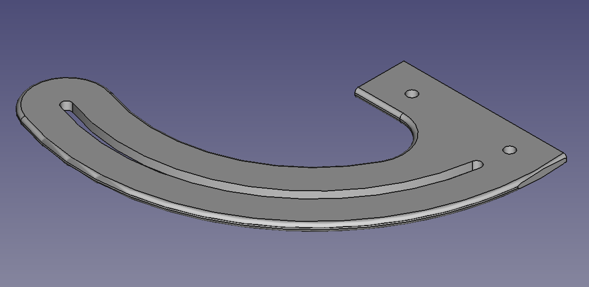

# 3D printing stuff

## Mainsail

[!WARNING] I replaced that printer, so all this may be outdated

Recently I replaced my Octoprint/Marlin-FW combination with Mainsail/Klipper. In the Mainsail folder I collect all the settings, macros etc for my setup. But a warning: My good old Anycubic i3 is modified, so a lot of settings may not work on other machines out of the box. My mods (incomplete list) are: BL Touch for mesh bed leveling, Trinamic stepper drivers, better fans and lots of small stuff I forgot about.

## Klipper

Stuff for my Neptune 4 Pro

# 3D-Parts

A collection of 3D printed parts I designed. The parts are either designed with OpenSCAD (the .scad files) or FreeCAD (the .FCStd files) but I usually also commit the exported STLs.

## Ballista

Parts to improve Zach307s awesome [Desktop Ballista](https://www.thingiverse.com/thing:3498574). Also available on [Thingiverse](https://www.thingiverse.com/thing:5982863)

## Caddy Buttonholder

Bracket for a push button and two 12V sockets, used in my camper

## Caddy Switchboard

Bracket for four carling switches and a LED dimmer. Separated in two parts for printing

## Caddy Gas Sensor Bracket

Bracket for a 3GAS Gas Sensor to mount on 30x30 profiles.

## Edding Clip

Clip for Edding Pens

## Figure Tube

Top and bottom parts to build a display case for collectors figures. Designed for "Plexiglas XT" tubes with a outer diameter of 120mm and 3mm thickness. The Top (currently WIP) supports LEDs.

## Gridfinity: Boxes for Tools

A few different 2x4 gridfinity boxes for brushes, sculpting tools and similar stuff.

## Gridfinity: DSPIAE Sanding Pad Stand

A 2x2 stand for DSPIAEs  acrylic sanding pads.

## Helinox Cupholder

A cupholder designed for the Helinox chair two. Maybe works with other chairs too

## Loetstaender

A soldering iron stand (german: "Lötständer") for a USB soldering iron and its tips.

## Heltec LoRa Display antenna holder

A holder heltecs LoRa display antenna

## LilyGo LoRa v1.3 Case

A simple case for LilyGos LoRa v1.3 module. No cover yet

## MHP30 Distance Holder

For the Miniware MHP30 Heatplate: A little holder/spacer for keeping the PCBs straight.

## Mansions of Madness: Inlays

Boxes for Mansions of Madness (Villen des Wahnsinns) for all the Tokens, Cards etc.

## Mansions of Madness: NPC Holder

A small piece for the MoM NPC Tokens.

## 20x20 Profile Drill Assistance

A small assistance for drilling holes into 20mm aluminum profiles. Uses hex nuts as drill guide

## 30x30 Profile Drill Assistance

A small assistance (In german "Bohrhilfe") for drilling holes into 30mm aluminum profiles. Uses hex nuts as drill guide

## 30x30 Profile Hinge Fix

Fixation for 30x30 aluminum profile hinges. The hinges I've got cannot really handle a lot, so I designed these thingys to fix the profiles in position.

## 30x30 Profile Lock

A lock I designed for the rack in my Volkswagen Caddy. Designed for Item 30x30 aluminum profiles but will probably work with others too.

## Wurkos TS21 Clip

A wall-mounted clip for a Wurkos TS21 LED flashlight. I screwed it to a 30x30 profile, but its not limited to these profiles

